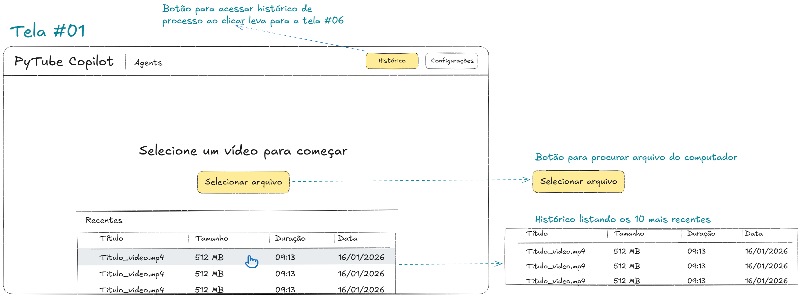
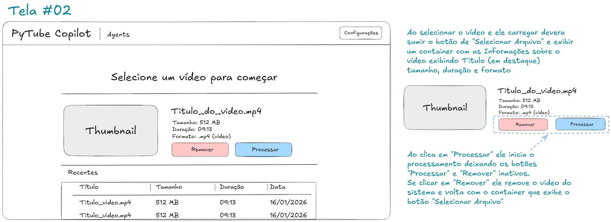
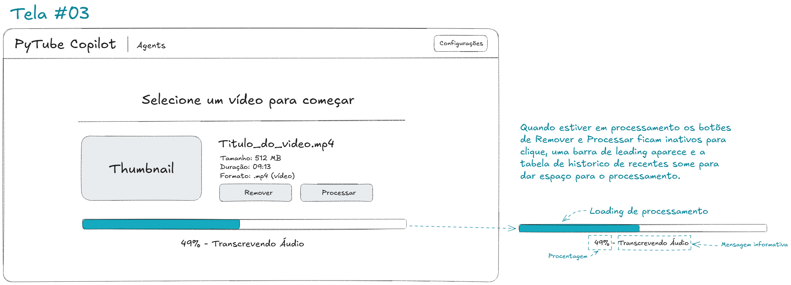
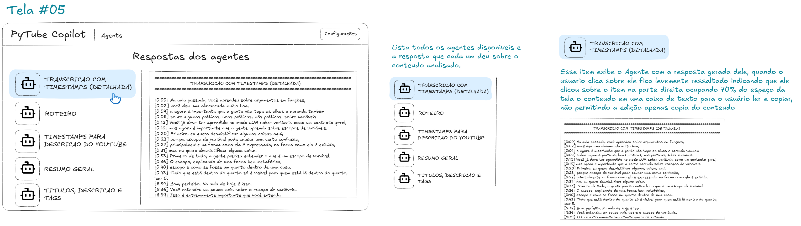
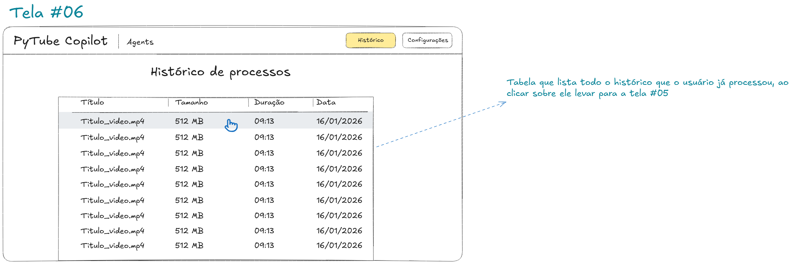
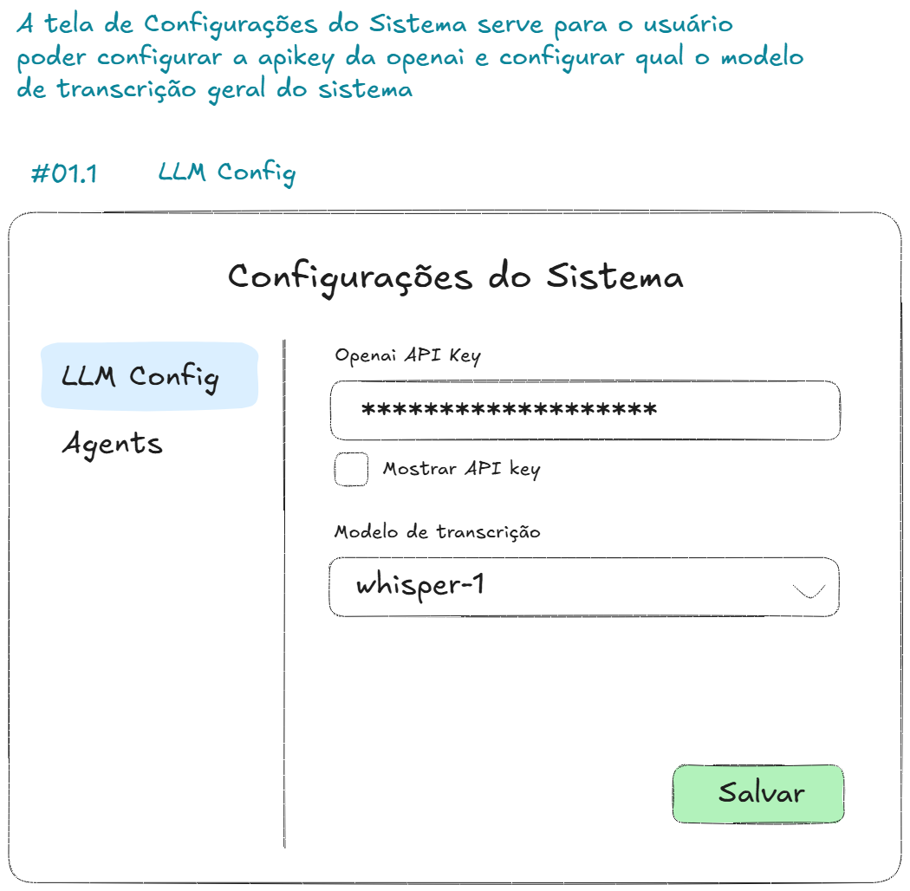
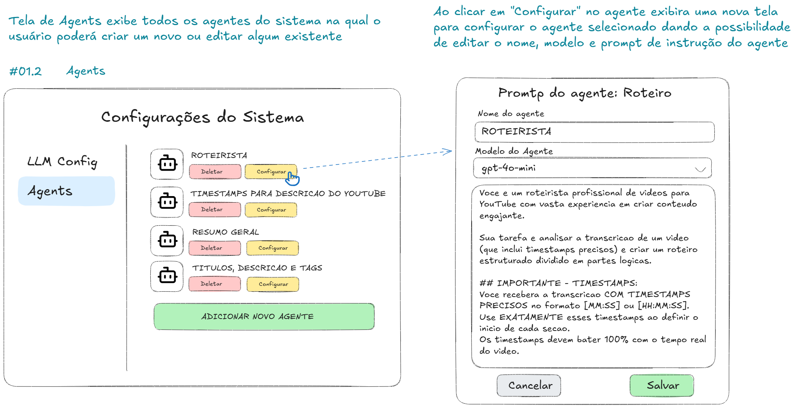

# PyTube Copilot v2.0.0

Sistema de IA para analise personalizada de videos, audios e documentos com interface grafica moderna.

O **PyTube Copilot** transcreve conteudo de midia utilizando a API **OpenAI Whisper** e processa o resultado atraves de um pipeline configuravel de **agentes de IA** (GPT-4o-mini, GPT-4o, GPT-4-turbo, GPT-3.5-turbo), gerando roteiros, timestamps, resumos, titulos, descricoes e tags otimizadas para YouTube.

---

## Indice

- [Funcionalidades](#funcionalidades)
- [Screenshots](#screenshots)
- [Arquitetura do Sistema](#arquitetura-do-sistema)
- [Formatos Suportados](#formatos-suportados)
- [Pre-requisitos](#pre-requisitos)
- [Instalacao](#instalacao)
- [Configuracao](#configuracao)
- [Como Usar](#como-usar)
- [Sistema de Agentes](#sistema-de-agentes)
- [Sistema de Pipelines](#sistema-de-pipelines)
- [Banco de Dados](#banco-de-dados)
- [Estrutura do Projeto](#estrutura-do-projeto)
- [Dependencias](#dependencias)
- [Solucao de Problemas](#solucao-de-problemas)

---

## Funcionalidades

### Processamento de Midia
- **Transcricao com Whisper**: Transcricao de audio e video usando OpenAI Whisper com timestamps detalhados por segmento
- **Extracao de audio**: Extracao automatica de audio de arquivos de video (MP4, MKV, AVI, MOV, WebM, FLV, WMV)
- **Divisao automatica**: Arquivos maiores que 25MB sao automaticamente divididos em partes de 10 minutos para transcricao
- **Ajuste de timestamps**: Os timestamps sao ajustados automaticamente ao juntar as partes, mantendo a sincronia com o arquivo original

### Processamento de Documentos
- **PDF**: Extracao de texto com contagem de paginas (via PyPDF2)
- **TXT**: Leitura com suporte a multiplos encodings (UTF-8, Latin-1, CP1252)
- **XLSX**: Extracao de dados de planilhas Excel com suporte a multiplas abas (via openpyxl)

### Sistema de Agentes de IA
- **4 agentes pre-configurados**: Roteirista, Timestamps para Descricao, Resumo Geral, Titulos/Descricao/Tags
- **Agentes customizaveis**: Crie, edite, reordene e delete agentes personalizados
- **Variaveis de template**: Use `{transcricao}`, `{transcricao_timestamps}`, `{duracao}` e `{response_agente_XX}` nos prompts
- **Encadeamento de respostas**: Agentes posteriores podem usar a resposta de agentes anteriores como input
- **Selecao de modelo por agente**: Cada agente pode usar um modelo GPT diferente

### Sistema de Pipelines
- **Pipeline padrao**: "Youtube Helper" com os 4 agentes do sistema
- **Pipelines customizaveis**: Crie pipelines com qualquer combinacao e ordem de agentes
- **Selecao na hora do processamento**: Escolha qual pipeline usar antes de processar

### Interface Grafica
- **CustomTkinter**: Interface moderna com tema claro (branco e azul)
- **Selecao de multiplos arquivos**: Selecione e processe varios arquivos de uma vez
- **Cards informativos**: Exibicao de tipo, tamanho, duracao e formato de cada arquivo
- **Barra de progresso detalhada**: Progresso em porcentagem com mensagem informativa do passo atual
- **Tabela de recentes**: Ultimos 20 projetos com acesso rapido aos resultados
- **Historico completo**: Tela dedicada com todos os projetos processados
- **Visualizacao de respostas**: Layout 30/70 com lista de agentes e area de conteudo
- **Viewer de prompt**: Modal para visualizar o prompt exato enviado a cada agente (debug)

### Seguranca
- **Banco de dados criptografado**: Dados salvos com criptografia Fernet (PBKDF2HMAC + SHA256)
- **API Key protegida**: Armazenada de forma criptografada, com toggle de visibilidade
- **Validacao de chave**: Verificacao de formato da API Key antes de salvar

---

## Screenshots

### Tela Inicial (Tela #01)
Tela principal com botao de selecao de arquivo, lista de formatos suportados e tabela de projetos recentes. Acesso rapido ao Historico e Configuracoes pelo header.



### Arquivo Selecionado (Tela #02)
Apos selecionar um arquivo, exibe um card com informacoes detalhadas: nome, tamanho, duracao e formato. Botoes "Remover" e "Processar" com seletor de pipeline.



### Processamento (Tela #03)
Durante o processamento, os botoes ficam inativos, a tabela de recentes e ocultada e uma barra de progresso aparece com porcentagem e mensagem informativa do passo atual (ex: "49% - Transcrevendo Audio").



### Resultado (Tela #04)
Ao finalizar, uma mensagem de sucesso (verde) ou erro (vermelho) aparece no lugar da barra de progresso. O botao "Acessar" leva diretamente para a tela de respostas dos agentes.


### Respostas dos Agentes (Tela #05)
Layout dividido: lista de agentes a esquerda (30%) e area de conteudo a direita (70%). Cada agente exibe sua resposta em uma caixa de texto com fonte monospacada. Botao "Ver prompt usado" para debug.



### Historico de Processos (Tela #06)
Tabela completa com todos os projetos processados. Colunas: Titulo, Tamanho, Duracao e Data. Clique em qualquer linha para abrir a tela de respostas dos agentes.



### Configuracoes - LLM Config (Tela #01.1)
Configuracao da OpenAI API Key (com mascara e toggle de visibilidade) e selecao do modelo de transcricao (Whisper).



### Configuracoes - Agents (Tela #01.2)
Gerenciamento dos agentes do sistema: listagem com ordem de execucao, botoes de reordenacao (subir/descer), configuracao individual com nome, modelo GPT e prompt de instrucao. Variaveis de template disponiveis exibidas como referencia.



---

## Arquitetura do Sistema

```
┌─────────────────────────────────────────────────────────────────┐
│                    PyTube Copilot (GUI)                         │
│                    CustomTkinter v5.2+                          │
├──────────┬──────────┬───────────┬───────────┬──────────────────┤
│  Home    │ History  │ Agent     │ Settings  │ Pipeline Config  │
│  Screen  │ Screen   │ Responses │ Window    │ Window           │
├──────────┴──────────┴───────────┴───────────┴──────────────────┤
│                     DatabaseManager                             │
│               (Fernet Encryption + Pickle)                      │
├─────────────────────────────────────────────────────────────────┤
│                     youtube_helper.py                           │
│          (Audio extraction, Transcription, Formatting)          │
├──────────────────┬──────────────────────────────────────────────┤
│  OpenAI Whisper  │            OpenAI GPT Models                 │
│  (Transcricao)   │  (gpt-4o-mini, gpt-4o, gpt-4-turbo, etc)   │
└──────────────────┴──────────────────────────────────────────────┘
```

### Fluxo de Processamento

```
1. Usuario seleciona arquivo(s)
          │
2. Deteccao do tipo de arquivo
          │
     ┌────┴────┐
     │         │
   MIDIA    DOCUMENTO
     │         │
3a. Extracao   3b. Extracao
    de audio       de texto
    (se video)     (TXT/PDF/XLSX)
     │         │
4a. Transcricao│
    Whisper     │
    + Timestamps│
     │         │
     └────┬────┘
          │
5. Pipeline de Agentes (sequencial)
   Agente 1 → Agente 2 → ... → Agente N
          │
6. Armazenamento no banco criptografado
          │
7. Exibicao dos resultados
```

---

## Formatos Suportados

| Categoria | Formatos | Processamento |
|:----------|:---------|:-------------|
| **Video** | `.mp4` `.mkv` `.avi` `.mov` `.webm` `.flv` `.wmv` | Extracao de audio → Transcricao Whisper → Agentes |
| **Audio** | `.mp3` `.wav` `.m4a` `.webm` `.mp4` `.mpeg` `.mpga` `.oga` `.ogg` | Transcricao Whisper → Agentes |
| **Texto** | `.txt` | Leitura direta → Agentes |
| **PDF** | `.pdf` | Extracao de texto por pagina → Agentes |
| **Planilha** | `.xlsx` | Extracao de dados por aba → Agentes |

---

## Pre-requisitos

- **Python 3.10+**
- **FFmpeg** instalado e disponivel no PATH (necessario para processamento de audio/video)
- **Chave de API da OpenAI** ([Obtenha aqui](https://platform.openai.com/api-keys))

### Instalando FFmpeg no Windows

1. Baixe o FFmpeg em [ffmpeg.org](https://ffmpeg.org/download.html)
2. Extraia o conteudo para uma pasta (ex: `C:\ffmpeg`)
3. Adicione `C:\ffmpeg\bin` a variavel de ambiente PATH
4. Verifique com: `ffmpeg -version`

---

## Instalacao

```bash
# Clone ou acesse o diretorio do projeto
cd velociscribe-mvp-py

# Crie um ambiente virtual
python -m venv .venv

# Ative o ambiente virtual
# Windows:
.venv\Scripts\activate

# Instale as dependencias
pip install -r requirements.txt
```

---

## Configuracao

### Primeira Execucao

Ao abrir o aplicativo pela primeira vez, um alerta solicitara a configuracao da **OpenAI API Key**:

1. Clique em **"Configurar API Key"**
2. Insira sua chave no formato `sk-proj-...`
3. Selecione o modelo de transcricao (padrao: `whisper-1`)
4. Clique em **"Salvar"**

### Configuracoes Disponiveis

| Configuracao | Descricao | Localidade |
|:-------------|:----------|:-----------|
| **OpenAI API Key** | Chave de autenticacao na API da OpenAI | Aba "LLM Config" |
| **Modelo de Transcricao** | Modelo Whisper para transcricao (`whisper-1`) | Aba "LLM Config" |
| **Agentes** | Criar, editar, reordenar e deletar agentes de IA | Aba "Agents" |
| **Pipelines** | Criar e configurar pipelines de processamento | Aba "Pipelines" |

---

## Como Usar

### 1. Selecionar Arquivo(s)

- Clique no botao **"Selecionar arquivo"** na tela inicial
- Selecione um ou mais arquivos suportados
- Os arquivos serao listados com badges de tipo (VIDEO, AUDIO, PDF, TXT, XLSX)
- Para midias, a duracao e calculada automaticamente em background

### 2. Escolher Pipeline

- No seletor abaixo da lista de arquivos, escolha o pipeline de processamento
- O pipeline padrao e **"Youtube Helper"** com os 4 agentes do sistema

### 3. Processar

- Clique no botao **"Processar"**
- Acompanhe o progresso pela barra com porcentagem e mensagem do passo atual
- Os passos incluem: Extracao de audio, Transcricao, e cada Agente do pipeline

### 4. Visualizar Resultados

- Ao concluir, clique no botao **"Acessar"**
- Na tela de respostas, selecione cada agente na lista lateral para ver o conteudo gerado
- Use o botao **"Ver prompt usado"** para debug e verificacao dos prompts enviados

### 5. Historico

- Acesse o botao **"Historico"** no header para ver todos os projetos processados
- Clique em qualquer projeto para reabrir seus resultados

---

## Sistema de Agentes

### Agentes Padrao do Sistema

| Ordem | Nome | Funcao |
|:------|:-----|:-------|
| #01 | **ROTEIRISTA** | Analisa a transcricao e cria um roteiro estruturado dividido em partes logicas com timestamps |
| #02 | **TIMESTAMPS PARA DESCRICAO DO YOUTUBE** | Cria lista formatada de timestamps para a descricao do video |
| #03 | **RESUMO GERAL** | Gera um resumo conciso em 3-5 paragrafos com os pontos mais importantes |
| #04 | **TITULOS, DESCRICAO E TAGS** | Gera titulos otimizados, descricao e tags para SEO do YouTube |

### Variaveis de Template

Os prompts dos agentes suportam as seguintes variaveis, substituidas automaticamente durante o processamento:

| Variavel | Descricao |
|:---------|:----------|
| `{transcricao}` | Texto completo da transcricao |
| `{transcricao_timestamps}` | Transcricao formatada com timestamps `[MM:SS] Texto...` |
| `{duracao}` | Duracao total do arquivo formatada (HH:MM:SS) |
| `{response_agente_01}` | Resposta gerada pelo agente #01 |
| `{response_agente_02}` | Resposta gerada pelo agente #02 |
| `{response_agente_XX}` | Resposta gerada pelo agente #XX (qualquer posicao anterior) |

### Criando um Agente Personalizado

1. Acesse **Configuracoes** → Aba **Agents**
2. Clique em **"ADICIONAR NOVO AGENTE"**
3. Preencha:
   - **Nome do agente**: Identificacao (ex: "ANALISE DE SENTIMENTO")
   - **Modelo do Agente**: Selecione o modelo GPT (gpt-4o-mini, gpt-4o, etc)
   - **Prompt de instrucao**: Escreva o prompt usando as variaveis disponiveis
4. Clique em **"Salvar"**

### Reordenando Agentes

- Use os botoes **^** (subir) e **v** (descer) ao lado de cada agente
- A ordem define a sequencia de execucao: agentes com numero menor executam primeiro
- Agentes posteriores podem acessar respostas de agentes anteriores via `{response_agente_XX}`

---

## Sistema de Pipelines

Pipelines definem **quais agentes** serao executados e em **qual ordem** durante o processamento.

### Pipeline Padrao

- **Youtube Helper**: Executa sequencialmente Roteirista → Timestamps → Resumo Geral → Titulos/Descricao/Tags

### Criando um Pipeline Personalizado

1. Acesse **Configuracoes** → Aba **Pipelines**
2. Clique em **"ADICIONAR NOVO PIPELINE"**
3. Preencha o **Nome do Pipeline**
4. Marque os agentes desejados com os checkboxes
5. Use os botoes **^** e **v** para definir a ordem de execucao
6. Clique em **"Salvar"**

---

## Banco de Dados

### Armazenamento

O sistema utiliza um banco de dados local baseado em arquivo `.pkl` (pickle serialization) com criptografia:

| Aspecto | Detalhe |
|:--------|:--------|
| **Arquivo** | `data/pytube_copilot.pkl` |
| **Criptografia** | Fernet (AES 128-bit CBC + HMAC SHA256) |
| **Derivacao de chave** | PBKDF2HMAC com SHA256 (100.000 iteracoes) |
| **Conteudo** | Projetos, Agentes, Pipelines, Configuracoes |

### Modelos de Dados

- **Project**: Arquivo processado com transcricao, segmentos com timestamps e respostas dos agentes
- **Agent**: Nome, modelo GPT, prompt de instrucao, ordem de execucao
- **Pipeline**: Nome e lista ordenada de IDs de agentes
- **AppConfig**: API Key, modelo Whisper, modelo GPT padrao, idioma

---

## Estrutura do Projeto

```
velociscribe-mvp-py/
├── pytube_copilot.py        # Aplicacao principal (GUI + logica)
├── youtube_helper.py        # Funcoes de extracao de audio, transcricao e formatacao
├── youtube_helper_gui.py    # GUI alternativa
├── velociscribe.py          # Versao CLI (linha de comando)
├── requirements.txt         # Dependencias Python
├── .env                     # Variaveis de ambiente (API keys)
├── .gitignore               # Arquivos ignorados pelo Git
├── README.md                # Esta documentacao
├── img/                     # Screenshots e imagens da documentacao
│   ├── 01_tela_inicial.png
│   ├── 01_01_config_llm.png
│   ├── 01_02_config_agents.png
│   ├── 02_arquivo_selecionado.png
│   ├── 03_processamento.png
│   ├── 04_resultado.png
│   ├── 05_respostas_agentes.png
│   └── 06_historico.png
├── prompts/                 # Prompts dos agentes do sistema
│   ├── roteirista.txt
│   ├── titulo_descricao_tags.txt
│   └── thumbnail.txt
├── data/                    # Banco de dados criptografado (gerado automaticamente)
│   └── pytube_copilot.pkl
├── youtube_analysis/        # Saidas de analise (gerado automaticamente)
└── transcricoes/            # Transcricoes CLI (gerado automaticamente)
```

---

## Dependencias

| Pacote | Versao | Funcao |
|:-------|:-------|:-------|
| `openai` | >= 1.0.0 | API da OpenAI (Whisper + GPT) |
| `rich` | >= 13.0.0 | Interface de terminal formatada (CLI) |
| `pydub` | >= 0.25.0 | Processamento e extracao de audio |
| `python-dotenv` | >= 1.0.0 | Carregamento de variaveis de ambiente |
| `customtkinter` | >= 5.2.0 | Framework GUI moderno (Tkinter) |
| `pillow` | >= 10.0.0 | Processamento de imagens |
| `cryptography` | >= 41.0.0 | Criptografia do banco de dados (Fernet) |

### Dependencias Opcionais

| Pacote | Funcao |
|:-------|:-------|
| `PyPDF2` | Extracao de texto de arquivos PDF |
| `openpyxl` | Leitura de planilhas Excel (.xlsx) |

---

## Solucao de Problemas

### "OPENAI_API_KEY nao encontrada"
- Configure a API Key pela interface: **Configuracoes** → **LLM Config** → insira a chave e salve

### "Erro ao extrair audio"
- Verifique se o **FFmpeg** esta instalado e acessivel no PATH
- Teste com: `ffmpeg -version`

### "PyPDF2 nao instalado"
- Instale com: `pip install PyPDF2`

### "openpyxl nao instalado"
- Instale com: `pip install openpyxl`

### Arquivo muito grande / Timeout
- Arquivos maiores que 25MB sao divididos automaticamente em partes de 10 minutos
- Verifique sua conexao com a internet (a API da OpenAI e chamada remotamente)
- Para arquivos muito longos (> 2 horas), considere dividir manualmente

### Banco de dados corrompido
- Delete o arquivo `data/pytube_copilot.pkl`
- Na proxima execucao, um novo banco sera criado com os agentes e pipelines padrao

---

## Licenca

Este projeto e privado e de uso pessoal.

---

> **PyTube Copilot v2.0.0** - Powered by OpenAI Whisper & GPT-4o-mini
